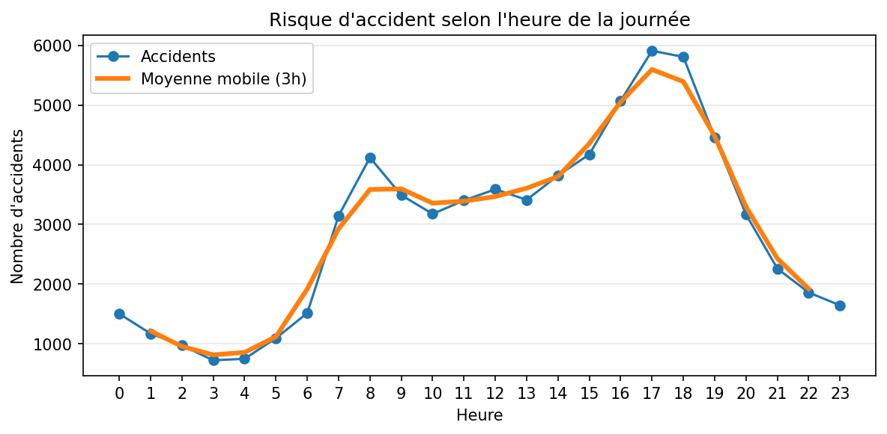
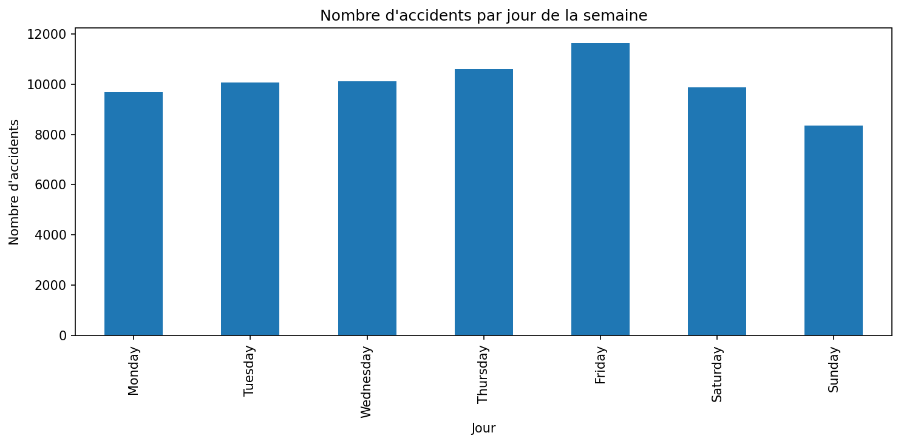
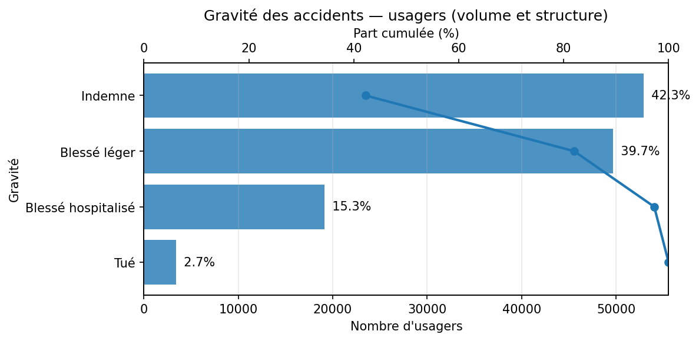
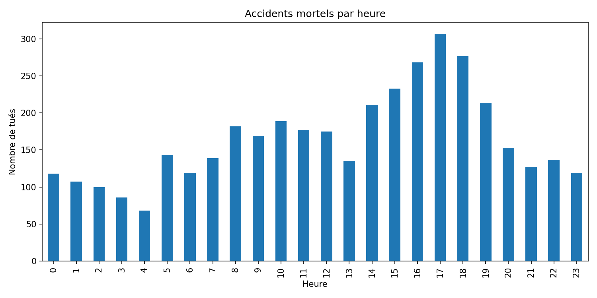
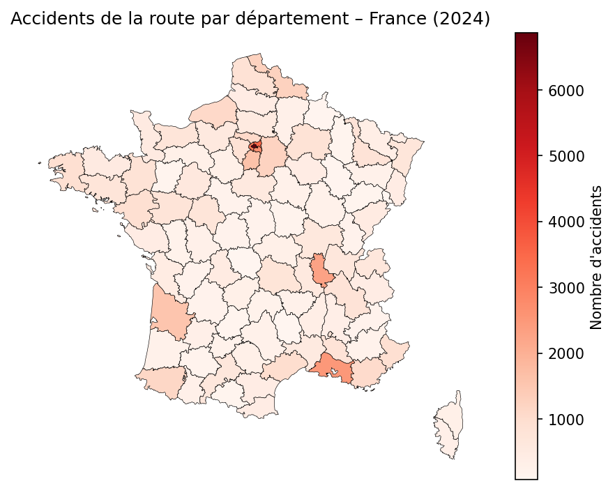

# Accidents de la route en France (BAAC) — Analyse Open Data

## Objectif
Analyser les accidents corporels de la circulation en France à partir des bases BAAC
afin d’identifier des patterns temporels et territoriaux (quand, où, qui est le plus touché) et produire des indicateurs utiles à la décision.

## Données
- Source : Bases de données annuelles des accidents corporels de la circulation (BAAC)
- Lien de la source : https://www.data.gouv.fr/datasets/bases-de-donnees-annuelles-des-accidents-corporels-de-la-circulation-routiere-annees-de-2005-a-2024
- Fichiers utilisés (par année) : caractéristiques, lieux, véhicules, usagers
- Niveau d’analyse :
  - Accident (caractéristiques + lieux)
  - Usager (gravité / profil) via jointures

## Méthodologie
1. Chargement robuste (séparateur/encodage)
2. Contrôle qualité (types, valeurs manquantes, doublons)
3. Jointures via l’identifiant d’accident (`Num_Acc`)
4. Feature engineering (date, heure, jour/semaine)
5. KPI + visualisations
6. Synthèse des insights & limites

## Résultats attendus (MVP)
- Accidents par heure / jour / mois
- Top départements (volume)
- Répartition de la gravité côté usagers
- Profils les plus exposés (catégorie d’usager, âge si disponible)

## Structure du repo
```text
accidents-france-baac/
├─ data/
│  ├─ geo/  
│  ├─ raw/              # CSV bruts
│  └─ processed/        # datasets fusionnés
├─ notebooks/
│  ├─ 01_eda.ipynb      # exploration & contrôle qualité
│  └─ 02_insights.ipynb # analyses & recommandations
├─ src/                 # fonctions réutilisables (chargement/clean/kpi)
├─ outputs/
│  ├─ figures/
│  ├─ report_eda.html
│  └─ report_insights.html
├─ requirements.txt
└─ README.md
```

## How to run

### Prérequis
- Python 3.10+ (recommandé)
- Git (optionnel)

### Installation (Windows PowerShell)
```powershell
python -m venv .venv
.\.venv\Scripts\Activate.ps1
pip install -r requirements.txt
```
### Exécution
Lancer les notebooks dans l’ordre :
1. `notebooks/01_eda.ipynb`
2. `notebooks/02_insights.ipynb`

## Rapports HTML

Les rapports HTML sont générés via Jupyter nbconvert.
Ils doivent être ouverts dans un navigateur web local.

- EDA : outputs/report_eda.html
- Insights : outputs/report_insights.html

Commande (Windows PowerShell) :
start outputs\report_eda.html
start outputs\report_insights.html

## Aperçu des résultats

### Accidents par heure


### Accidents par jour de la semaine


### Gravité des accidents (usagers)


### Accidents mortels par heure


### Carte – Accidents par département


## Key insights (TL;DR)

- Les accidents se concentrent principalement aux heures de pointe (7–9h, 17–19h).
- Les départements les plus peuplés concentrent le volume brut d’accidents.
- Les blessés légers représentent la majorité des usagers impliqués.
- Les accidents mortels présentent une distribution horaire distincte.


