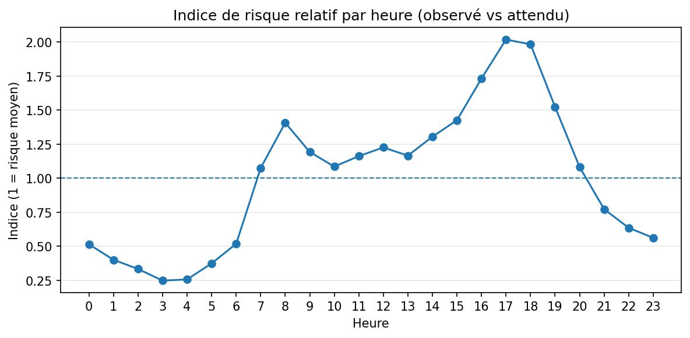
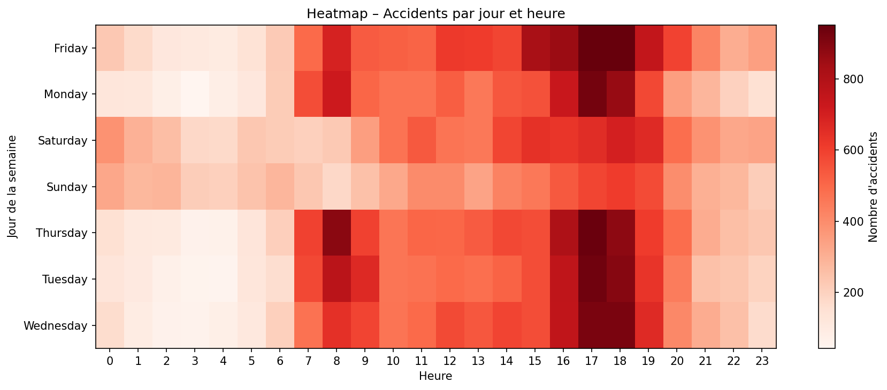
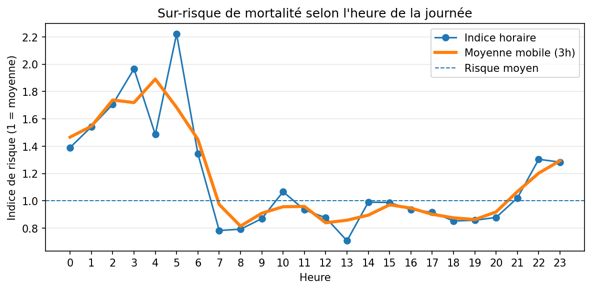
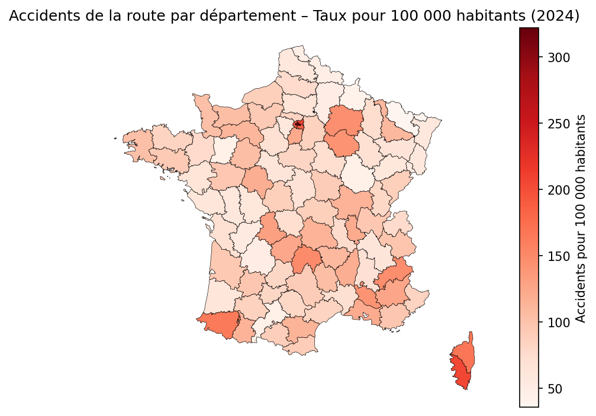

# Accidents de la route en France (BAAC) — Analyse Open Data

## Objectif
Analyser les accidents corporels de la circulation en France à partir des bases BAAC afin d’identifier des patterns temporels et territoriaux (quand, où) et de produire des indicateurs d’aide à la décision.

L’analyse est complétée par un volet de machine learning visant à estimer le risque de mortalité d’un accident, à partir des caractéristiques disponibles avant l’issue de l’accident.

## Données
- Source : Bases de données annuelles des accidents corporels de la circulation (BAAC)
- Lien : https://www.data.gouv.fr/datasets/bases-de-donnees-annuelles-des-accidents-corporels-de-la-circulation-routiere-annees-de-2005-a-2024
- Fichiers utilisés (par année) : caractéristiques, lieux, véhicules, usagers
- Niveau d’analyse :
  - Accident (caractéristiques + lieux)
  - Usager (gravité) via jointures
Ces données sont enrichies par des sources externes afin de permettre des analyses territoriales comparables.
- Données complémentaires :
  - Fichier géographique des départements (GeoJSON) utilisé pour la cartographie des accidents.
  - Données de population par département utilisées pour le calcul des taux d’accidents pour 100 000 habitants.

## Méthodologie
1. Chargement robuste (séparateur/encodage)
2. Contrôle qualité (types, valeurs manquantes, doublons)
3. Jointures via l’identifiant d’accident (`Num_Acc`)
4. Feature engineering (date, heure, jour)
5. KPI + visualisations 
6. Modélisation prédictive (machine learning) :
- Construction d’une variable cible indiquant si un accident est mortel
- Sélection de variables explicatives disponibles avant l’issue de l’accident
- Entraînement de modèles de classification avec gestion du déséquilibre de classes
7. Synthèse des insights, performances du modèle et limite

Les comparaisons territoriales reposent sur des indicateurs normalisés par la population.

## Résultats attendus (MVP)
- Identifier les principaux patterns temporels.
- Analyser la répartition de la gravité des accidents côté usagers.
- Mettre en évidence les périodes à sur-risque de mortalité selon l’heure.
- Comparer les départements selon le niveau d’accidents, à partir de taux rapportés à la population.
- Produire un score de risque permettant d’identifier les accidents les plus susceptibles d’être mortels.


## Structure du repo
```text
accidents-france-baac/
├─ data/
│  ├─ geo/
│  ├─ population/
│  ├─ processed/        # datasets fusionnés et prêts pour l'analyse / ML
│  └─ raw/              # CSV bruts
├─ docs/
│  ├─ report_eda.html
│  └─ report_insights.html
├─ notebooks/
│  ├─ 01_eda.ipynb      # exploration & contrôle qualité
│  ├─ 02_insights.ipynb # analyses & recommandations
│  └─ 03_ml.ipynb       # exploration et validation des résultats ML
├─ outputs/
│  └─ figures/
├─ models/              # modèles entraînés (.joblib)
├─ reports/
│  └─ ml/               # métriques, courbes PR, calibration, confusion matrix
├─ src/                 # fonctions réutilisables (cleaning, features, ML)
├─ README.md
└─ requirements.txt
```

## How to run

### Prérequis
- Python 3.10+ (recommandé)
- Git (optionnel)

### Installation (Windows PowerShell)
```powershell
python -m venv .venv
.\.venv\Scripts\Activate.ps1
pip install -r requirements.txt
```
### Exécution
Lancer les notebooks dans l’ordre :
1. `notebooks/01_eda.ipynb`
2. `notebooks/02_insights.ipynb`
3. `notebooks/03_ml.ipynb`

## Rapports HTML

Les rapports HTML sont générés via Jupyter nbconvert.
Ils doivent être ouverts dans un navigateur web local.

- EDA : outputs/report_eda.html
- Insights : outputs/report_insights.html
- ML : outputs/ml/report.html

Commande (Windows PowerShell) :
start outputs\report_eda.html
start outputs\report_insights.html
start outputs\ml\report.html

## Aperçu des résultats

### Accidents par heure


### Accidents par jour de la semaine


### Gravité des accidents (usagers)


### Sur-risque de mortalité par heure


### Carte – Accidents par département


## Key insights (TL;DR)

- Les accidents se concentrent principalement en semaine aux heures de pointe (7–9h, 17–19h).
- Les blessés légers représentent la majorité des usagers impliqués.
- Les accidents mortels présentent une distribution horaire distincte, avec un sur-risque marqué durant la nuit et en début de matinée, indépendamment du volume d’accidents observé.
- Les départements présentant les taux les plus élevés combinent des profils contrastés : hyper-urbanisation (Paris), contraintes géographiques (Corse-du-Sud, Hautes-Alpes) ou forte exposition aux axes routiers rapides (Marne, Aube).
- Le modèle de machine learning permet d’identifier un sous-ensemble réduit d’accidents concentrant une part significative du risque de mortalité, ouvrant la voie à des actions de prévention ciblées.


